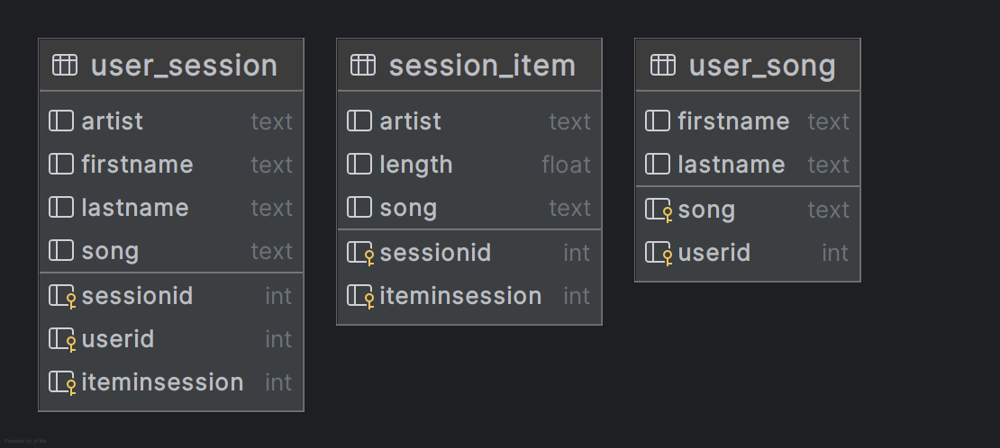
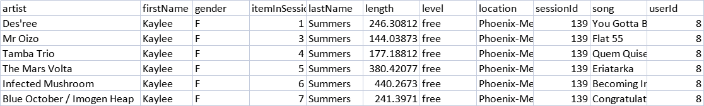

[](https://www.python.org/)
[](#license)

# Data Modeling with Apache Cassandra

> Demonstrating data modeling in Apache Cassandra and building an ETL pipeline in Python  
> by Patryk Czubinski

---

## Table of Contents

1. [Overview](#overview)
2. [Queries](#queries)
3. [Data Architecture](#data-architecture)
4. [Data Visualization](#data-visualization)
5. [Prerequisites](#prerequisites)
6. [Getting Started](#getting-started)
    1. [Install Dependencies](#install-dependencies)
    2. [Set Up Jupyter Kernel](#set-up-jupyter-kernel)
    3. [Start Docker](#start-docker)
    4. [Run the ETL Pipeline](#run-the-etl-pipeline)
7. [Lessons Learned](#lessons-learned)
8. [Contact](#contact)
9. [Acknowledgements](#acknowledgements)
10. [License](#license)

---

## Overview

This project showcases:

- Designing Cassandra tables keyed and clustered to support specific query patterns
- Building an ETL pipeline in Python to ingest, transform, and load event data into Cassandra
- Executing queries to verify data integrity and performance

## Queries

We cover three core use cases:

1. **Song Details by Session**  
   Retrieve details of a song played during a given session on the music app.
2. **User’s Session History**  
   List all songs a specific user played in one session.
3. **Listeners of a Song**  
   Identify all users who listened to a particular song.

## Data Architecture

  
*Figure: Logical tables and key design in Cassandra*

## Data Visualization

An excerpt from `events.csv`:

  
*Figure: Example of raw event records*

---

## Prerequisites

- **Python 3.11** (note: 3.13 is not yet supported)
- **Docker Desktop** (for running Cassandra via Docker Compose)

---

## Getting Started

### 1. Install Dependencies

```bash
pip install -r requirements.txt
````

### 2. Set Up Jupyter Kernel

```bash
pip install ipykernel
python -m ipykernel install \
  --user \
  --name=data_modeling_cassandra_3_11 \
  --display-name="Data Modeling with Cassandra (Py 3.11)"
```

Then select the **Data Modeling with Cassandra (Py 3.11)** kernel in Jupyter.

### 3. Start Docker

Ensure Docker Desktop is running, then:

```bash
docker compose up -d
```

This boots a Cassandra instance defined in `docker-compose.yml`.

### 4. Run the ETL Pipeline

1. Open `notebooks/notebook_1.ipynb` in Jupyter.
2. Execute all cells in order to:

    * Parse and transform raw event data
    * Create Cassandra keyspaces and tables
    * Insert data into tables
    * Run sample queries to validate results

---

## Lessons Learned

* **Primary Key Design**
  Craft partition and clustering keys around query requirements to ensure efficient reads.
* **Python & Cassandra**
  Leveraging Python libraries (e.g., `cassandra-driver`, `pandas`) streamlines data processing and DB interactions.
* **Scalability Considerations**
  Data modeling for wide tables vs. narrow tables impacts performance and storage—you must balance your read/write
  patterns.

---

## Contact

* 🔗 [LinkedIn](https://www.linkedin.com/in/patryk-czubinski-1928-sql)
* 🐙 [GitHub](https://github.com/czubi1928)

---

## Acknowledgements

Inspired by the Udacity Data Engineering Projects:
[Data Modeling with Postgres](https://github.com/san089/Udacity-Data-Engineering-Projects/tree/master/Data_Modeling_with_Postgres)

---

## License

This project is licensed under the MIT License. See [LICENSE](LICENSE) for details.
